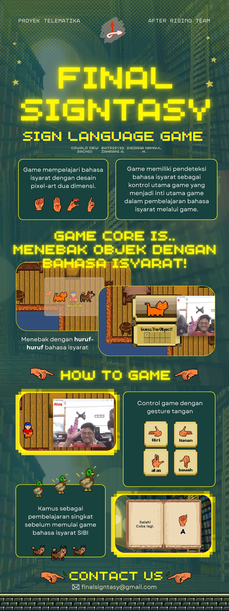

# Final Signtasy: Sign Language Game 
Game design for Final Signtasy, a pixel 2D game top-down.

## Acknowledgement
I would like to express my gratitude to the following website support to our game assets project:

- top down game reference [Stardew Valley Wiki](https://stardewvalleywiki.com/Stardew_Valley_Wiki)
- font [Humble Fonts Free](https://somepx.itch.io/humble-fonts-free)
- wallpaper [RythmicSpark](https://wall.alphacoders.com/big.php?i=705836)
- SIBI Language [Kamus SIBI from Kemdikbud](https://www.ypedulikasihabk.org/2018/11/09/mengenal-bahasa-isyarat/)
- music from itch.io

Special thanks to everyone who has helped and supported this project!

